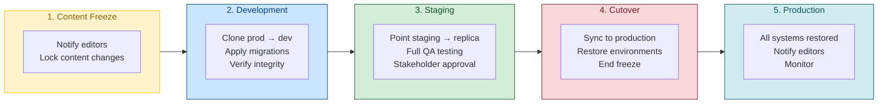

# Sanity CMS Data Migration

> Part of [Planetary Agency Standards](../STANDARDS.md)

---

## Overview

This document outlines the safe migration process for Sanity CMS schema changes and data migrations. The process ensures zero downtime, data integrity, and rollback capability.

---

## Migration Phases



---

## Environment Configuration by Phase

### Quick Reference Table

| Phase | Development App | Staging App | Production App | Backup |
|:------|:---------------:|:-----------:|:--------------:|:------:|
| **1. Content Freeze** | `development` | `production` | `production` | Active |
| **2. Development** | `production-replica` | `production` | `production` | Active |
| **3. Staging** | `production-replica` | `production-replica` | `production` | Active |
| **4. Cutover** | `production-replica` | `production-replica` | `production-replica` | Active |
| **5. Production** | `development` | `production` | `production` | — |

### Detailed Flow Diagram

```mermaid
flowchart TB
    subgraph LEGEND["Legend"]
        direction LR
        LEG_DEV[("development")]
        LEG_PROD[("production")]
        LEG_REP[("production<br/>replica")]
        LEG_BACKUP["Backup Active"]

        style LEG_DEV fill:#e3f2fd,stroke:#1976d2
        style LEG_PROD fill:#fff3e0,stroke:#f57c00
        style LEG_REP fill:#f3e5f5,stroke:#7b1fa2
        style LEG_BACKUP fill:#ff9800,stroke:#e65100,color:#fff
    end

    subgraph PHASE1["Phase 1: Content Freeze"]
        direction TB
        P1_WARN["⚠️ CONTENT FREEZE<br/>Notify all editors and stakeholders"]

        subgraph P1_ENV["Environment Configuration"]
            direction LR
            subgraph P1_DEV["Development"]
                P1_DB1[("development")] --> P1_APP1["Dev App"]
            end
            subgraph P1_STG["Staging"]
                P1_DB2[("production")] --> P1_APP2["Staging App"]
            end
            subgraph P1_PRD["Production"]
                P1_DB3[("production")] --> P1_APP3["Prod App"]
            end
        end
        P1_BACKUP["Production Backup"]

        style P1_WARN fill:#fff3cd,stroke:#ffc107,color:#856404
        style P1_BACKUP fill:#ff9800,stroke:#e65100,color:#fff
        style P1_DB1 fill:#e3f2fd,stroke:#1976d2
        style P1_DB2 fill:#fff3e0,stroke:#f57c00
        style P1_DB3 fill:#fff3e0,stroke:#f57c00
    end

    subgraph PHASE2["Phase 2: Development"]
        direction TB
        P2_DESC["Clone production data to development dataset<br/>Apply and test all schema migrations locally<br/>Verify data integrity before proceeding"]

        subgraph P2_ENV["Environment Configuration"]
            direction LR
            subgraph P2_DEV["Development"]
                P2_DB1[("production<br/>replica")] --> P2_APP1["Dev App"]
            end
            subgraph P2_STG["Staging"]
                P2_DB2[("production")] --> P2_APP2["Staging App"]
            end
            subgraph P2_PRD["Production"]
                P2_DB3[("production")] --> P2_APP3["Prod App"]
            end
        end
        P2_BACKUP["Production Backup"]

        style P2_DESC fill:#cce5ff,stroke:#004085,color:#004085
        style P2_BACKUP fill:#ff9800,stroke:#e65100,color:#fff
        style P2_DB1 fill:#f3e5f5,stroke:#7b1fa2
        style P2_DB2 fill:#fff3e0,stroke:#f57c00
        style P2_DB3 fill:#fff3e0,stroke:#f57c00
    end

    subgraph PHASE3["Phase 3: Staging"]
        direction TB
        P3_DESC["Point staging environment to migrated dataset<br/>Perform full QA testing<br/>Get stakeholder approval before production"]

        subgraph P3_ENV["Environment Configuration"]
            direction LR
            subgraph P3_DEV["Development"]
                P3_DB1[("production<br/>replica")] --> P3_APP1["Dev App"]
            end
            subgraph P3_STG["Staging"]
                P3_DB2[("production<br/>replica")] --> P3_APP2["Staging App"]
            end
            subgraph P3_PRD["Production"]
                P3_DB3[("production")] --> P3_APP3["Prod App"]
            end
        end
        P3_BACKUP["Production Backup"]

        style P3_DESC fill:#d4edda,stroke:#155724,color:#155724
        style P3_BACKUP fill:#ff9800,stroke:#e65100,color:#fff
        style P3_DB1 fill:#f3e5f5,stroke:#7b1fa2
        style P3_DB2 fill:#f3e5f5,stroke:#7b1fa2
        style P3_DB3 fill:#fff3e0,stroke:#f57c00
    end

    subgraph PHASE4["Phase 4: Cutover ~ Switch"]
        direction TB
        P4_DESC["Sync migrated data back to production dataset<br/>Restore all environments to standard configuration<br/>End content freeze"]

        subgraph P4_ENV["Environment Configuration"]
            direction LR
            subgraph P4_DEV["Development"]
                P4_DB1[("production<br/>replica")] --> P4_APP1["Dev App"]
            end
            subgraph P4_STG["Staging"]
                P4_DB2[("production<br/>replica")] --> P4_APP2["Staging App"]
            end
            subgraph P4_PRD["Production"]
                P4_DB3[("production<br/>replica")] --> P4_APP3["Prod App"]
            end
        end
        P4_BACKUP["Production Backup"]

        style P4_DESC fill:#f8d7da,stroke:#721c24,color:#721c24
        style P4_BACKUP fill:#ff9800,stroke:#e65100,color:#fff
        style P4_DB1 fill:#f3e5f5,stroke:#7b1fa2
        style P4_DB2 fill:#f3e5f5,stroke:#7b1fa2
        style P4_DB3 fill:#f3e5f5,stroke:#7b1fa2
    end

    subgraph PHASE5["Phase 5: Production"]
        direction TB
        P5_DESC["All environments restored to standard configuration<br/>Content freeze ended<br/>Notify editors - migration complete"]

        subgraph P5_ENV["Environment Configuration"]
            direction LR
            subgraph P5_DEV["Development"]
                P5_DB1[("development")] --> P5_APP1["Dev App"]
            end
            subgraph P5_STG["Staging"]
                P5_DB2[("production")] --> P5_APP2["Staging App"]
            end
            subgraph P5_PRD["Production"]
                P5_DB3[("production")] --> P5_APP3["Prod App"]
            end
        end

        style P5_DESC fill:#d1ecf1,stroke:#0c5460,color:#0c5460
        style P5_DB1 fill:#e3f2fd,stroke:#1976d2
        style P5_DB2 fill:#fff3e0,stroke:#f57c00
        style P5_DB3 fill:#fff3e0,stroke:#f57c00
    end

    PHASE1 --> PHASE2 --> PHASE3 --> PHASE4 --> PHASE5
```



---

## Phase Details

### Phase 1: Content Freeze

**Objective**: Prevent content changes during migration

**Actions**:
- [ ] Notify all editors and content managers
- [ ] Document freeze start time
- [ ] Disable content editing permissions (optional)
- [ ] Confirm all stakeholders acknowledge the freeze

**Duration**: Until Phase 5 completion

---

### Phase 2: Development

**Objective**: Apply and test migrations safely

**Actions**:
- [ ] Create production backup
- [ ] Clone production dataset to `production-replica`
- [ ] Point development environment to replica
- [ ] Apply all schema migrations
- [ ] Run data migration scripts
- [ ] Verify data integrity
- [ ] Test all GROQ queries
- [ ] Validate frontend functionality

**Commands**:
```bash
# Export production dataset
npx sanity dataset export production ./backups/production-$(date +%Y%m%d).tar.gz

# Create replica from production
npx sanity dataset import ./backups/production-*.tar.gz production-replica --replace

# Run migrations on replica
npx sanity migration run --dataset production-replica
```

---

### Phase 3: Staging

**Objective**: Full QA and stakeholder approval

**Actions**:
- [ ] Point staging environment to `production-replica`
- [ ] Perform comprehensive QA testing
- [ ] Test all content types and components
- [ ] Verify image/asset migrations
- [ ] Check SEO metadata
- [ ] Test preview functionality
- [ ] Get stakeholder sign-off

**Environment Config**:
```env
# .env.staging
SANITY_DATASET=production-replica
```

---

### Phase 4: Cutover ~ Switch

**Objective**: Apply migrations to production

**Actions**:
- [ ] Final backup of production
- [ ] Sync `production-replica` to `production`
- [ ] Verify production data integrity
- [ ] Update all environment configs
- [ ] Test production briefly
- [ ] Prepare rollback procedure

**Commands**:
```bash
# Final production backup
npx sanity dataset export production ./backups/production-pre-migration-$(date +%Y%m%d).tar.gz

# Sync replica to production
npx sanity dataset import ./backups/replica-migrated.tar.gz production --replace

# Or use Sanity's dataset copy (if available)
npx sanity dataset copy production-replica production
```

---

### Phase 5: Production

**Objective**: Restore normal operations

**Actions**:
- [ ] Restore all environments to standard datasets
- [ ] End content freeze
- [ ] Notify all editors
- [ ] Monitor for issues (24-48 hours)
- [ ] Archive migration backups
- [ ] Document any issues encountered

**Communication**:
```
Subject: Content Freeze Ended - Migration Complete

The Sanity CMS migration has been completed successfully.
Content editing is now available.

If you encounter any issues, please report them immediately.
```

---

## Rollback Procedure

If issues are discovered at any phase:

```bash
# Restore from backup
npx sanity dataset import ./backups/production-pre-migration-*.tar.gz production --replace

# Revert schema changes (if using git)
git checkout main -- schemas/

# Redeploy previous version
```

---

## Checklist Summary

```
Pre-Migration
[ ] All stakeholders notified
[ ] Content freeze announced
[ ] Production backup created
[ ] Migration scripts tested locally

Migration
[ ] Development testing complete
[ ] Staging QA approved
[ ] Stakeholder sign-off received
[ ] Production cutover successful

Post-Migration
[ ] All environments restored
[ ] Content freeze lifted
[ ] Editors notified
[ ] Monitoring in place
```

---

## Related Documentation

- [Deployment Standards](./deployment.md)
- [Sanity Official Migration Guide](https://www.sanity.io/docs/schema-and-content-migrations)
