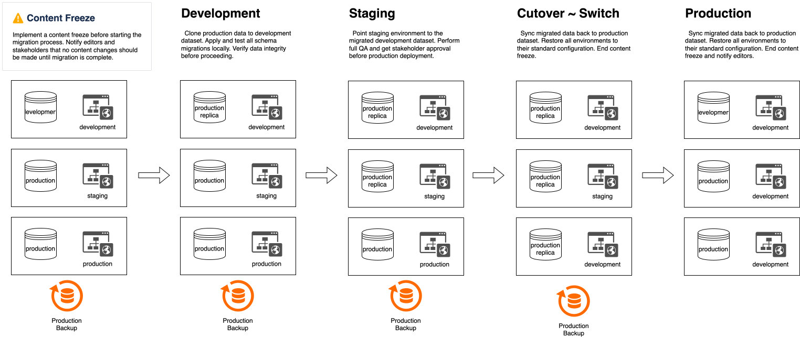

# Tooling Standards

> Part of [Planetary Agency Standards](../STANDARDS.md)

---

## Required Tools (All Projects)

### 1. ESLint + Prettier (Code Quality)
```json
// package.json
{
  "devDependencies": {
    "eslint": "^8.57.0",
    "eslint-config-next": "latest",
    "eslint-config-prettier": "^9.1.0",
    "prettier": "^3.2.0"
  },
  "scripts": {
    "lint": "next lint",
    "format": "prettier --write .",
    "format:check": "prettier --check ."
  }
}
```

### 2. TypeScript (Type Safety)
```json
{
  "devDependencies": {
    "typescript": "^5.3.0",
    "@types/node": "^20.11.0",
    "@types/react": "^18.2.0",
    "@types/react-dom": "^18.2.0"
  },
  "scripts": {
    "type-check": "tsc --noEmit"
  }
}
```

### 3. Storybook (Component Documentation)
```json
{
  "devDependencies": {
    "@storybook/react": "^8.0.0",
    "@storybook/nextjs": "^8.0.0"
  },
  "scripts": {
    "storybook": "storybook dev -p 6006",
    "build-storybook": "storybook build"
  }
}
```

**When to Use Storybook**:
- Projects with 10+ custom components
- Design system components
- Components used across multiple pages
- When PMs/designers need to preview components

**When to Skip**:
- Small single-page sites
- Prototype projects
- Internal tools

### 4. Sanity CLI (CMS Management)
```json
{
  "devDependencies": {
    "@sanity/cli": "^3.0.0"
  },
  "scripts": {
    "sanity:deploy": "sanity deploy",
    "sanity:graphql": "sanity graphql deploy"
  }
}
```

#### Data Migration Process

When schema changes require data migrations (adding fields, restructuring content, etc.), follow this process to ensure zero data loss and minimal downtime.



**⚠️ CRITICAL: Implement a content freeze before starting the migration process. Notify editors and stakeholders that no content changes should be made until migration is complete.**

##### Migration Steps

1. **Export Production Dataset**
   ```bash
   sanity dataset export production ./backups/production-YYYY-MM-DD.tar.gz
   ```

2. **Replace Development Dataset with Production**
   ```bash
   # Delete current development dataset
   sanity dataset delete development
   # Import production data into development
   sanity dataset import ./backups/production-YYYY-MM-DD.tar.gz development
   ```

3. **Apply Migrations in Development**
   - Run migration scripts against the development dataset
   - Test schema changes and data transformations
   ```bash
   sanity exec ./migrations/your-migration.ts --with-user-token
   ```

4. **Local QA**
   - Test all content types and queries
   - Verify data integrity
   - Test frontend functionality against development dataset

5. **Point Staging to Development Dataset**
   - Update staging environment variables:
     ```bash
     NEXT_PUBLIC_SANITY_DATASET=development
     ```
   - Redeploy staging environment

6. **Staging QA**
   - Full QA pass on staging environment
   - Verify all functionality with migrated data
   - Get stakeholder approval

7. **Point Production to Development Dataset**
   - Update production environment variables:
     ```bash
     NEXT_PUBLIC_SANITY_DATASET=development
     ```
   - Redeploy production environment

8. **Production QA**
   - Verify production is working with migrated data
   - Monitor for any issues

9. **Sync Back to Production Dataset**
   ```bash
   # Export the migrated development dataset
   sanity dataset export development ./backups/development-migrated-YYYY-MM-DD.tar.gz
   # Replace production dataset with migrated data
   sanity dataset delete production
   sanity dataset import ./backups/development-migrated-YYYY-MM-DD.tar.gz production
   ```

10. **Restore Correct Environment Configuration**
    - Update environment variables back to normal:
      ```bash
      NEXT_PUBLIC_SANITY_DATASET=production
      ```
    - Redeploy all environments

11. **Final Production QA**
    - Full QA pass on production
    - Verify all content and functionality
    - **End content freeze** - notify editors they can resume work

##### Best Practices

- **Always backup before any destructive operations**
- **Never skip the content freeze** - data created during migration will be lost
- **Document all migration scripts** in the `/migrations` directory
- **Test migrations on development first** - never run untested migrations on production
- **Keep backup archives** for at least 30 days after successful migration

---

## ❌ DO NOT USE (Removed from Standards)

### husky (Pre-commit Hooks) - REMOVED

**Why Removed**:
- Slows down developer workflow
- Can be bypassed with `--no-verify`
- Causes friction for contractors
- Better to catch issues in CI/PR review
- False sense of security

**Instead**:
- Run `npm run lint` manually before committing
- CI checks on PR (GitHub Actions)
- Code review catches issues
- Trust developers to run checks

---

## Optional Tools (Project-Specific)

### Testing
```bash
# Only add if client requires tests or complex logic
npm install -D vitest @testing-library/react @testing-library/jest-dom

# Or for E2E
npm install -D playwright @playwright/test
```

### Animation Libraries
```bash
# For complex animations
npm install gsap framer-motion

# For simple transitions - use CSS/Tailwind
```

### State Management
```bash
# Only when needed (complex state across many components)
npm install zustand
```
